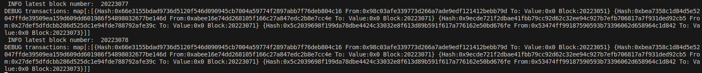

### Block Parser

RESTful API implementation of Ethereum blockchain parser that will allow to query transactions for subscribed
addresses.

#### HOW TO USE
```
    cd blockchain_parser
    go run main.go
```

#### DEMO

